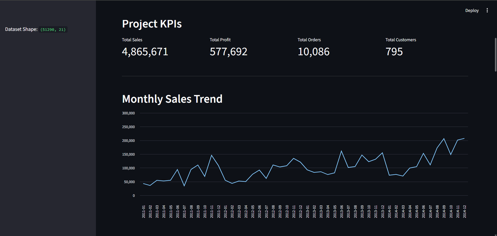
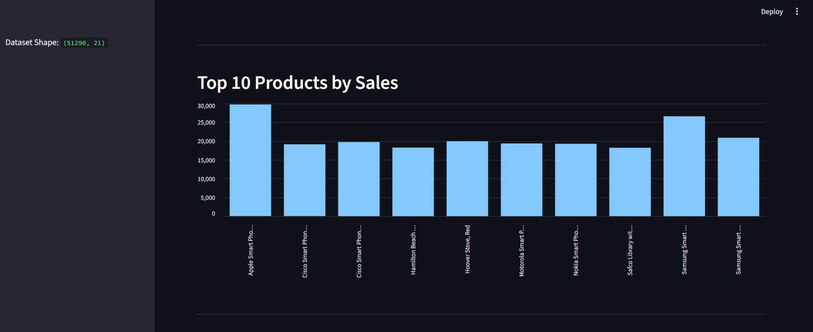
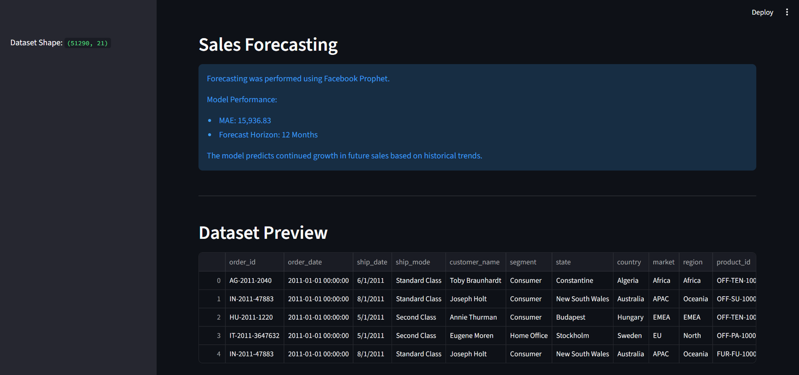
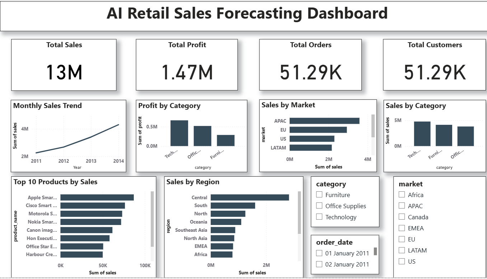

# 📈 AI Retail Sales Forecasting

## Project Overview

This project analyzes historical retail sales data from the Global Superstore dataset and forecasts future sales using Machine Learning and Time Series Forecasting techniques.

The project helps businesses understand sales patterns, identify high-performing products and markets, and make data-driven decisions.

---

## Problem Statement

Retail businesses require accurate sales forecasting to optimize inventory management, improve business planning, and maximize profitability.

This project uses historical sales data to analyze business performance and forecast future sales trends using Facebook Prophet.

---

## Dataset Information

**Dataset:** Global Superstore Dataset

**Records:** 51,290

**Features:** 21

The dataset contains:

* Order Information
* Customer Details
* Product Details
* Market Information
* Sales
* Profit
* Discount
* Shipping Information

---

## Technologies Used

* Python
* Pandas
* NumPy
* Matplotlib
* Streamlit
* Facebook Prophet
* Power BI
* Jupyter Notebook

---

## Project KPIs

| KPI             | Value     |
| --------------- | --------- |
| Total Sales     | 4,865,671 |
| Total Profit    | 577,692   |
| Total Orders    | 10,086    |
| Total Customers | 795       |

---

## Features

### Streamlit Dashboard

* Sales Overview
* Monthly Sales Trend
* Sales by Category
* Profit by Category
* Sales by Market
* Top Selling Products
* Dataset Preview
* Business Insights

### Sales Forecasting

* Time Series Forecasting using Facebook Prophet
* Future Sales Prediction
* Forecast Visualization
* Model Performance Evaluation

### Power BI Dashboard

* Interactive KPI Cards
* Sales Trend Analysis
* Category Analysis
* Market Analysis
* Product Performance Analysis
* Business Insights

---

## Dashboard Screenshots

### Streamlit Dashboard Overview



### Streamlit Analytics Dashboard



### Sales Forecasting Dashboard



### Power BI Dashboard



---

## Forecasting Results

### Model

Facebook Prophet

### Forecast Horizon

12 Months

### Model Performance

**MAE (Mean Absolute Error):**

15,936.83

The model predicts a positive sales growth trend based on historical sales patterns.

---

## Business Insights

* Technology category generated the highest sales.
* Technology category generated the highest profit.
* APAC market generated the highest revenue.
* Higher discounts negatively affected profitability.
* Sales show a positive growth trend over time.
* Forecast results indicate future sales growth potential.

---

## Project Structure

```text
AI-Retail-Sales-Forecasting/
│
├── app.py
├── README.md
├── requirements.txt
├── Sales_Forecasting.ipynb
├── SuperStoreOrders.csv.zip
├── AI_Retail_Sales_Forecasting.pbix
│
├── streamlit_overview.png
├── streamlit_analytics.png
├── streamlit_forecasting.png
└── powerbi_dashboard.png
```

---

## Installation

Clone the repository:

```bash
git clone https://github.com/your-username/AI-Retail-Sales-Forecasting.git
```

Install dependencies:

```bash
pip install -r requirements.txt
```

Run Streamlit application:

```bash
streamlit run app.py
```

---

## Future Improvements

* Deploy Streamlit application on Streamlit Cloud
* Add advanced forecasting models
* Implement real-time sales monitoring
* Add customer segmentation analysis
* Create interactive filtering options

---

## Developed By

**Prasitha**
